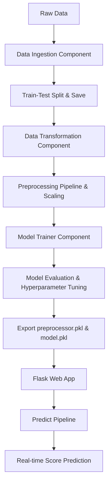

# Student Exam Performance Indicator 🎓🔮

An End-to-End Machine Learning project designed to analyze student data and predict academic outcomes. This project implements a robust ML pipeline from raw data ingestion to transformation, model selection, hyperparameter tuning, and a sleek, interactive web interface for real-time inference.

---

## 🚀 Overview

The primary goal of this project is to predict a student's **Maths Score** (out of 100) based on demographic attributes, parental background, test preparation, and other academic scores. By leveraging machine learning, educators and administrators can identify key factors impacting student performance and design tailored interventions.

### 🌐 Live Interface Demo

The frontend is a beautifully designed, responsive web application utilizing a modern **glassmorphic dark theme** built with HTML5 and custom CSS3.

---

## 🛠️ Architecture & Pipeline

The project follows a modular software engineering structure:



### Key Components

1. **Data Ingestion (`src/components/data_ingestion.py`)**:
   - Reads student data from local/remote sources.
   - Splits data into training and test sets.
   - Saves train/test artifacts.

2. **Data Transformation (`src/components/data_transformation.py`)**:
   - Implements robust pre-processing pipelines.
   - Performs One-Hot Encoding for categorical features.
   - Applies StandardScaler to numerical features.
   - Saves the transformation pipeline as `preprocessor.pkl`.

3. **Model Trainer (`src/components/model_trainer.py`)**:
   - Trains multiple classification/regression algorithms (e.g., Random Forest, Decision Tree, Gradient Boosting, Linear Regression, XGBoost, CatBoost, AdaBoost).
   - Optimizes models via hyperparameter tuning.
   - Selects the best performing model based on R² score and saves it as `model.pkl`.

4. **Prediction Pipeline (`src/pipeline/predict_pipeline.py`)**:
   - Reconstructs student attributes from web inputs.
   - Loads artifacts (`model.pkl` & `preprocessor.pkl`).
   - Scales the input features and performs real-time model prediction.

---

## 📊 Features & Input Schema

The predictive model takes the following student parameters:

| Category | Input Feature | Expected Type | Description |
| :--- | :--- | :--- | :--- |
| **Demographics** | Gender | `Categorical` | Male / Female |
| **Demographics** | Race/Ethnicity | `Categorical` | Group A, B, C, D, or E |
| **Background** | Parental Level of Education | `Categorical` | Associate's, Bachelor's, Master's, High School, etc. |
| **Background** | Lunch Type | `Categorical` | Standard / Free or Reduced |
| **Preparation** | Test Preparation Course | `Categorical` | None / Completed |
| **Academic** | Reading Score | `Numerical` | Score out of 100 |
| **Academic** | Writing Score | `Numerical` | Score out of 100 |

**Target Variable:** `Maths Score` (Continuous, range: 0-100)

---

## 💻 Tech Stack

- **Backend Logic:** Flask (Python 3.8+)
- **Data Engineering:** Pandas, Numpy
- **Machine Learning:** Scikit-Learn, XGBoost, CatBoost
- **Data Visualization:** Seaborn, Matplotlib
- **Frontend Design:** Modern CSS Grid, Glassmorphism, Google Fonts (Plus Jakarta Sans), Custom Responsive SVG Layouts

---

## 🏃‍♂️ How to Run Locally

Follow these steps to set up and run the application on your local machine:

### 1. Clone the Repository
```bash
git clone <repository-url>
cd mlproject
```

### 2. Set Up a Virtual Environment
```bash
# Windows
python -m venv venv
venv\Scripts\activate

# macOS/Linux
python3 -m venv venv
source venv/bin/activate
```

### 3. Install Dependencies
```bash
pip install -r requirements.txt
```

### 4. Run the Training Pipeline (Optional)
If you want to train the model and generate new `.pkl` artifacts:
```bash
python src/components/data_ingestion.py
```

### 5. Launch the Web Application
```bash
python application.py
```

Open your browser and navigate to:
👉 **[http://localhost:8000/prediction](http://localhost:8000/prediction)**

---

## 💅 UI/UX Enhancements

We updated the application view (`templates/home.html`) with:
*   **Modern Glassmorphism:** Frosted-glass container backgrounds with linear gradient backdrops for a premium aesthetic.
*   **Intuitive Sections:** Clear layout split into *Demographics*, *Background*, and *Academic Scores*.
*   **Focus Micro-animations:** Input fields glow and scale subtly on focus, guiding user interaction.
*   **Custom Select Arrows & Validation Styles:** Sleek SVG-based select indicator and styling that alerts the user on validation checks.
*   **Dynamic Result Card:** Highlights the predicted score using a large font and a success-colored, gradient-bordered card that fades into view only when a prediction has been calculated.